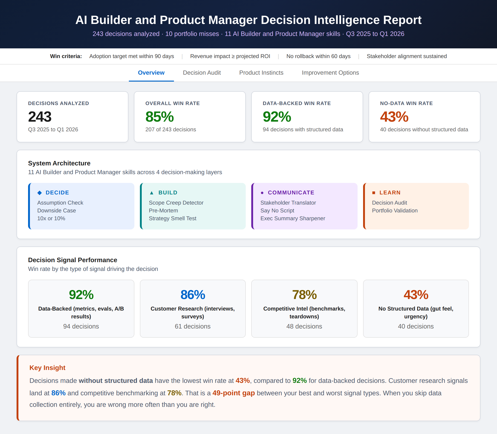
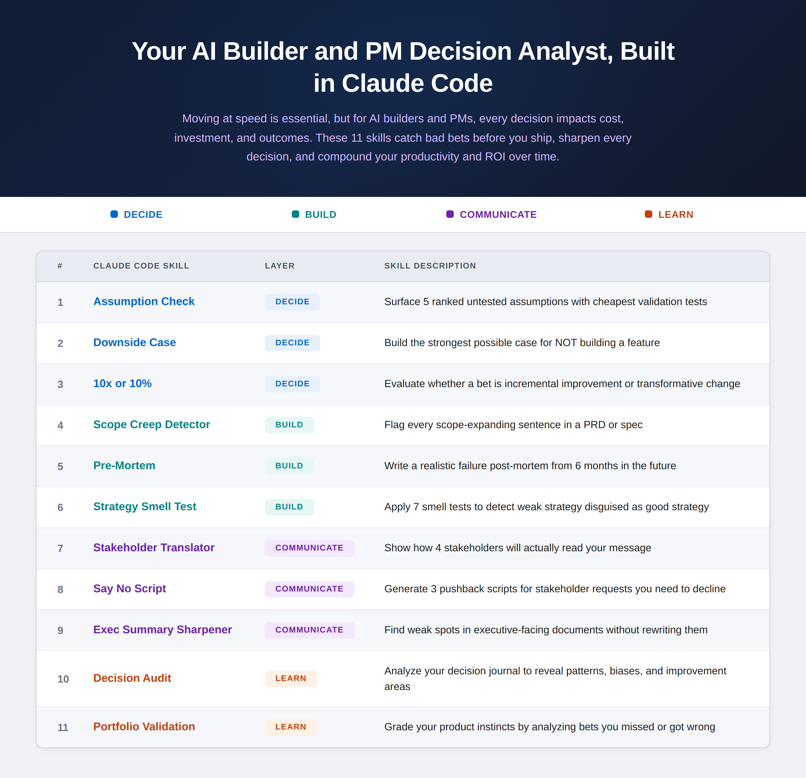
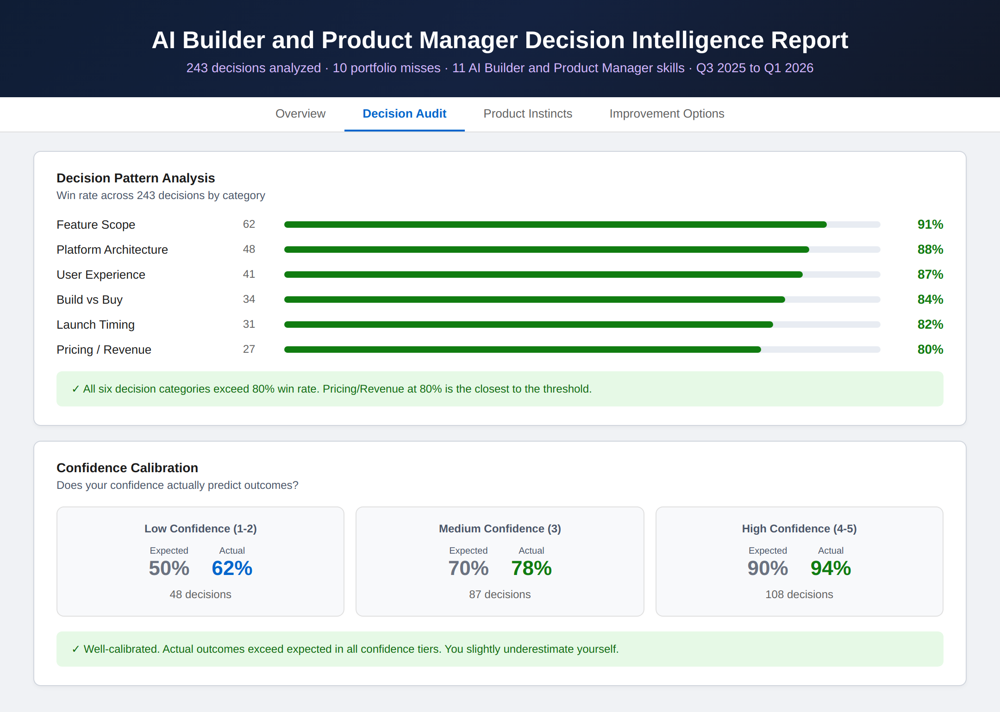
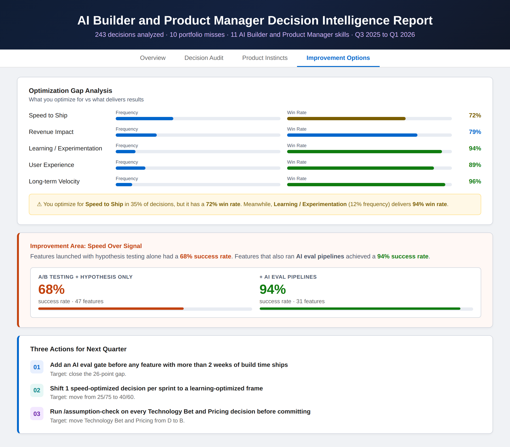
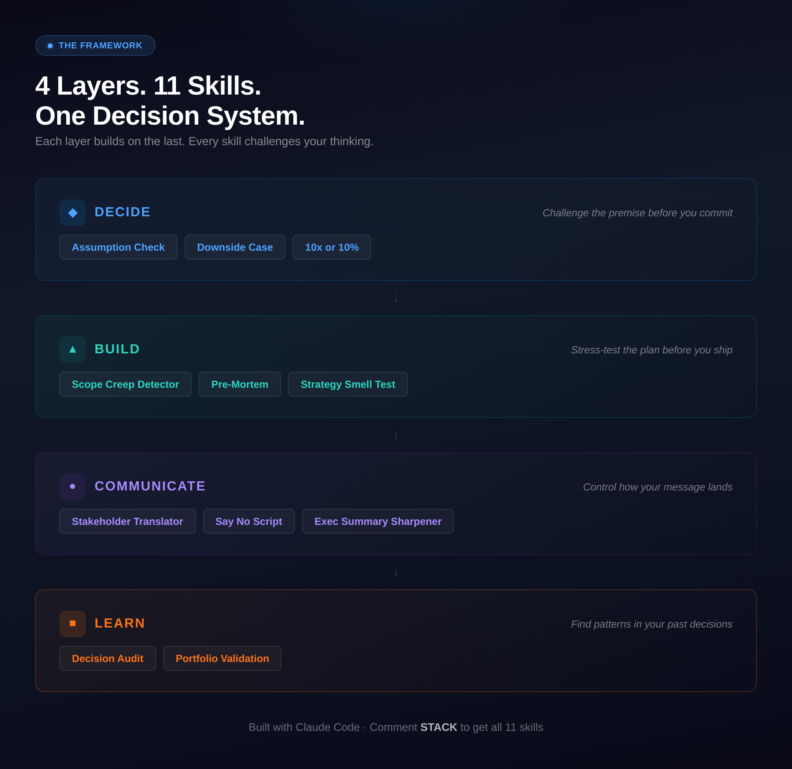

<div align="center">

# 🎯 AI Builder Decision Analyst

### 11 Claude Code skills that catch bad bets before you ship, sharpen every decision, and compound your productivity and ROI over time.

[](#the-11-skills-across-four-layers)
[](LICENSE)
[](https://claude.ai/code)

**Maintained by [Varun Kulkarni](https://github.com/varunk130)** · [Setup ↓](#setup-5-minutes) · [Skills ↓](#the-11-skills-across-four-layers) · [Decision Sequence ↓](#the-decision-sequence)

</div>

---



## What This Is

A set of Claude Code slash commands organized around how product decisions actually flow. Each skill targets a specific decision failure mode. A `CLAUDE.md` file holds your product context, decision history, and known biases so every skill has the full picture.

No app. No API. Markdown files in a folder.

## The 11 Skills Across Four Layers



### ✅ DECIDE — Before you commit

| # | Command | What It Does |
|---|---------|-------------|
| 1 | `/project:assumption-check` | Surface 5 ranked untested assumptions with cheapest validation tests |
| 2 | `/project:downside-case` | Build the strongest possible case for NOT building a feature |
| 3 | `/project:10x-or-10-percent` | Evaluate whether a bet is incremental improvement or transformative change |

### 🛠️ BUILD — Before you ship

| # | Command | What It Does |
|---|---------|-------------|
| 4 | `/project:scope-creep-detector` | Flag every scope-expanding sentence in a PRD or spec |
| 5 | `/project:pre-mortem` | Write a realistic failure post-mortem from 6 months in the future |
| 6 | `/project:strategy-smell-test` | Apply 7 smell tests to detect weak strategy disguised as good strategy |

### 🧠 COMMUNICATE — Before you present

| # | Command | What It Does |
|---|---------|-------------|
| 7 | `/project:stakeholder-translator` | Show how 4 stakeholders will actually read your message |
| 8 | `/project:say-no-script` | Generate 3 pushback scripts for stakeholder requests you need to decline |
| 9 | `/project:exec-summary-sharpener` | Find weak spots in executive-facing documents without rewriting them |

### 🔁 LEARN — After you decide

| # | Command | What It Does |
|---|---------|-------------|
| 10 | `/project:decision-audit` | Analyze your decision journal to reveal patterns, biases, and improvement areas |
| 11 | `/project:portfolio-validation` | Grade your product instincts by analyzing bets you missed or got wrong |

## The Decision Intelligence Report

The LEARN layer is what changed things for me. Log your decisions in the journal, run `/project:decision-audit`, and get a report showing where you optimize for speed when experimentation wins, where you skip structured evaluation, and where your confidence doesn't match your outcomes.





## Setup (5 minutes)

### Prerequisites

- [Claude Code](https://docs.anthropic.com/en/docs/claude-code) installed and authenticated

### Option 1: Clone and use

```bash
git clone https://github.com/varunk130/AI-Builder-Decision-Analyst.git
cd AI-Builder-Decision-Analyst

# Install the skills into your user-level Claude Code commands directory
mkdir -p ~/.claude/commands
cp skills/*.md ~/.claude/commands/

# Then run any command from any project
claude "/user:assumption-check We're building a self-serve analytics dashboard for SMB customers"
```

### Option 2: Add to an existing project

```bash
mkdir -p your-project/.claude/commands
cp AI-Builder-Decision-Analyst/skills/*.md your-project/.claude/commands/
cp -r AI-Builder-Decision-Analyst/templates/ your-project/templates/
```

### Option 3: User-level commands (available in all projects)

```bash
mkdir -p ~/.claude/commands
cp AI-Builder-Decision-Analyst/skills/*.md ~/.claude/commands/
# Now use /user:assumption-check from any project
```

> 📝 **Slash-command prefix:** Claude Code namespaces commands by install location.
> Use `/user:<command>` when installed at user level (Options 1 and 3) and
> `/project:<command>` when installed at project level (Option 2). The command
> tables below show the bare command name — pick the prefix that matches your install.

## How to Use the Decision Journal

1. Open `templates/decision-journal.md`
2. Log each decision using the template format (takes ~2 minutes per entry)
3. After 15-20 entries, run `/project:decision-audit`
4. Review your Decision Intelligence Report
5. Run again in 90 days to track how your patterns shift

The journal captures: what you decided, what you rejected, what you optimized for, who influenced you, your confidence level, and the outcome.

## The Decision Sequence

For major product decisions, run these in order:

```
1. /project:assumption-check       → Find what you don't know
2. /project:downside-case          → Stress-test the idea
3. /project:10x-or-10-percent      → Clarify the bet size
4. /project:scope-creep-detector   → Tighten the spec
5. /project:pre-mortem             → Anticipate failure
6. /project:strategy-smell-test    → Validate the strategy
```

If your idea survives all 6, ship it with confidence.



## How to Get the Most Out of It

**Be specific in your input.** "We're building a dashboard" is weak. "We're building a self-serve analytics dashboard for SMB e-commerce brands who currently export CSV reports weekly and share them in Slack" is strong.

**Disagree with the output.** These skills are designed to push back. If you can refute every argument, your thinking is solid. If you can't refute one — you found a blind spot.

**Log everything.** The LEARN layer gets sharper the more decisions you log. 20 entries is the minimum for meaningful pattern detection.

## Repo Structure

```
AI-Builder-Decision-Analyst/
├── README.md
├── skills/
│   ├── assumption-check.md        # DECIDE layer
│   ├── downside-case.md
│   ├── 10x-or-10-percent.md
│   ├── scope-creep-detector.md    # BUILD layer
│   ├── pre-mortem.md
│   ├── strategy-smell-test.md
│   ├── stakeholder-translator.md  # COMMUNICATE layer
│   ├── say-no-script.md
│   ├── exec-summary-sharpener.md
│   ├── decision-audit.md          # LEARN layer
│   └── portfolio-validation.md
├── templates/
│   ├── decision-journal.md        # Log your decisions here
│   └── anti-portfolio.md          # Log your misses here
└── assets/                        # Carousel images
```

---

## Contributing

See [CONTRIBUTING.md](CONTRIBUTING.md) for scope, branch / PR flow, and the skill file format.

---

## Related Work

Part of a portfolio of AI agent and skill libraries for product, GTM, and decision-making teams.

**Discovery & research**

- [ai-customer-discovery-skills](https://github.com/varunk130/ai-customer-discovery-skills) - Turn raw customer signal into validated product opportunities (12 skills planned)
- [jtbd-extractor](https://github.com/varunk130/jtbd-extractor) - Extract Jobs-to-be-Done statements from research, with opportunity scoring

**Strategy & decisions**

- [claude-code-skills](https://github.com/varunk130/claude-code-skills) - 29 production-grade skills for finance, product, strategy, and game theory

**Go-to-market**

- [ai-gtm-skill-library](https://github.com/varunk130/ai-gtm-skill-library) - 31 opinionated GTM skills across the full discover -> renew lifecycle
- [ai-marketing-claude-skills](https://github.com/varunk130/ai-marketing-claude-skills) - 12 marketing-ops skills with scoring algorithms and statistical frameworks
- [ai-partner-ecosystem-analysis](https://github.com/varunk130/ai-partner-ecosystem-analysis) - Deep research on any ISV, partner, or competitor with a 1-slide PPTX output

**UX & design**

- [ai-ux-skill-library](https://github.com/varunk130/ai-ux-skill-library) - 12 frameworks for designing UX for AI products, agents, and AI-powered experiences

**Multi-agent demos**

- [ai-pm-agents-suite](https://github.com/varunk130/ai-pm-agents-suite) - 6-agent pipeline plus 3 standalone PM agents (decision engine, financial analyst, stakeholder translator) that turn customer feedback into strategy, PRDs, and comms
- [ai-legal-team-agent](https://github.com/varunk130/ai-legal-team-agent) - 4-agent legal analysis team with Python orchestrator and Claude Code skills

**Evaluation & operations**

- [AI-Eval-Skills](https://github.com/varunk130/AI-Eval-Skills) - 6 skills to plan, generate, run, interpret, and triage AI agent evaluations
- [ai-workflow-playbooks](https://github.com/varunk130/ai-workflow-playbooks) - 21 playbooks + 10 skills + 4 guardians + 5 runbooks across the 7-stage delivery pipeline

---

## License

MIT — see [LICENSE](LICENSE) for the full text.

---

## Disclaimer

All decision data in the templates is fictional and anonymized. The entries are examples to show how the journal and audit work. Replace them with your own decisions to get real value from the LEARN layer.

---

**Built by [Varun Kulkarni](https://www.linkedin.com/in/varun-kulkarni/) — AI Product Manager building tools that help AI builders 10x their impact.**
Star the repo or leave feedback if it's useful.
